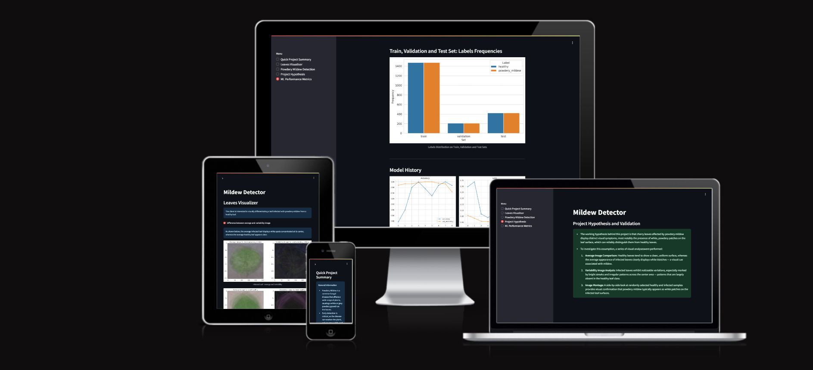

# Mildew Detection in Cherry Leaves



- This project focuses on developing an automated system for detecting powdery mildew in plants using machine learning techniques. The solution leverages deep learning models to classify images of plant leaves as either "Infected" or "Uninfected" with powdery mildew. The project uses a convolutional neural network (CNN) trained on labeled leaf images to detect and predict the presence of mildew with high accuracy.

- By integrating this model into a user-friendly web application, powered by Streamlit, users can upload plant images and receive instant predictions about whether their plant is infected with powdery mildew. The app provides real-time feedback with visualizations of prediction probabilities, helping users take timely action to prevent further spread of the disease.

- The live application can be found [here](https://mildew-detection-in-cherry-leaves-vsfn.onrender.com)

## Table of Contents
1. [Introduction](#mildew-detection-in-cherry-leaves)
2. [Dataset Content](#dataset-content)
3. [Business Requirements](#business-requirements)
4. [Hypothesis and how to validate](#hypothesis-and-how-to-validate)
5. [The rationale to map the business requirements to the Data Visualisations and ML tasks](#the-rationale-to-map-the-business-requirements-to-the-data-visualisations-and-ml-tasks)
6. [ML business case](#ml-business-case)
7. [User Stories](user-stories)
8. [Dashboard Design](#dashboard-design)
9. [Unfixed Bugs](#unfixed-bugs)
10. [Deployment](#deployment)
11. [Main Data Analysis and Machine Learning Libraries](#main-data-analysis-and-machine-learning-libraries)
12. [Testing](#testing)
13. [Credits](#credits)
14. [Acknowledgements](#acknowledgements)

## Dataset Content

- The dataset is sourced from [Kaggle](https://www.kaggle.com/codeinstitute/cherry-leaves). We then created a fictitious user story where predictive analytics can be applied in a real project in the workplace.
- The dataset contains +4 thousand images taken from the client's crop fields. The images show healthy cherry leaves and cherry leaves that have powdery mildew, a fungal disease that affects many plant species. The cherry plantation crop is one of the finest products in their portfolio, and the company is concerned about supplying the market with a compromised quality product.

## Business Requirements

The cherry plantation crop from Farmy & Foods is facing a challenge where their cherry plantations have been presenting powdery mildew. Currently, the process is manual verification if a given cherry tree contains powdery mildew. An employee spends around 30 minutes in each tree, taking a few samples of tree leaves and verifying visually if the leaf tree is healthy or has powdery mildew. If there is powdery mildew, the employee applies a specific compound to kill the fungus. The time spent applying this compound is 1 minute. The company has thousands of cherry trees located on multiple farms across the country. As a result, this manual process is not scalable due to the time spent in the manual process inspection.

To save time in this process, the IT team suggested an ML system that detects instantly, using a leaf tree image, if it is healthy or has powdery mildew. A similar manual process is in place for other crops for detecting pests, and if this initiative is successful, there is a realistic chance to replicate this project for all other crops. The dataset is a collection of cherry leaf images provided by Farmy & Foods, taken from their crops.

- 1 - The client is interested in conducting a study to visually differentiate a healthy cherry leaf from one with powdery mildew.
- 2 - The client is interested in predicting if a cherry leaf is healthy or contains powdery mildew.

## Hypothesis and how to validate

### Hypothesis 1:
Healthy cherry leaves and those affected by powdery mildew show distinct visual differences that can be identified through image analysis.

### Validation:
To confirm this, a visual inspection study will be performed by examining a representative sample of images from both categories. The goal is to assess whether the differences are consistently noticeable to the human eye, which would justify the use of image-based machine learning for automated detection.

### Hypothesis 2:
A machine learning model can be trained to classify cherry leaves as either healthy or infected with powdery mildew, achieving an accuracy rate of at least 97%.

### Validation:
This hypothesis will be tested by training a model using labeled image data and evaluating its performance on a separate, unseen validation set. If the model reaches or exceeds the target accuracy, the hypothesis will be considered valid, demonstrating its potential for real-world deployment on cherry farms.

[Back to top](#table-of-contents)

## The rationale to map the business requirements to the Data Visualisations and ML tasks

### Business Requirement 1

 - The client is interested in conducting a study to visually differentiate a healthy cherry leaf from one affected by powdery mildew.

 #### Rationale for Data Visualisation Tasks
 
 ##### Average Image Calculation:
   - Generate an average image for each class (healthy and powdery mildew) to highlight the typical appearance and structure of leaves in both categories.

 ##### Image Variability Analysis:
   - Create variability (standard deviation) images for each class to visualize the range of differences within the same category, helping to identify consistent features and outliers.

 ##### Difference Image Comparison:
   - Compute and display a difference image between the average healthy leaf and the average powdery mildew-infected leaf. This will provide a direct visual representation of class distinctions.

 ##### Image Montage Creation:
   - Display montages of sample images for both healthy and mildew-infected leaves to give a quick visual overview and support human intuition about the dataset.
 
 These visual tools will allow both technical and non-technical stakeholders to better understand the feasibility of automating the detection process and highlight the visual basis for model training.

 ### Business Requirement 2
   - The client is interested in predicting if a cherry leaf is healthy or contains powdery mildew using an ML system.

 #### Rationale for Machine Learning Tasks
   - This requirement will be addressed by developing a classification model capable of processing leaf images and predicting their health status. The tasks to meet this requirement include:

 ##### Data Preprocessing:
   - Images will be resized and normalized to ensure consistent input dimensions for model training, while balancing between image quality and model size. Given the original 256x256 resolution, alternative shapes such as 100x100 or 50x50 may be used to reduce the final model size to under 100MB for easier deployment and GitHub version control.


This structured approach ensures that the model is not only technically sound but also practically useful in reducing manual inspection time and supporting large-scale deployment.

[Back to top](#table-of-contents)

## ML Business Case

- Given the need to automate the identification of powdery mildew on cherry leaves, this project applies a supervised machine learning approach specifically designed for binary image classification. The task is to categorize images of cherry leaves into one of two classes: healthy or infected.
- The business goal required the model to meet a minimum prediction accuracy of 97% to ensure that it could reliably support decision-making in the field. This target was achieved through model tuning, validation, and evaluation on unseen image data.
- A Convolutional Neural Network (CNN) was selected for this project, as it is well-suited for extracting spatial and visual patterns from image data. The model was designed as a two-class, single-label classifier. An adaptive learning optimizer, such as Adagrad, was used to efficiently adjust learning rates during training, helping to improve convergence and stability.
- The deployment of this model allows the stakeholder to significantly reduce the time and labor involved in manually inspecting each cherry tree for signs of mildew. With real-time predictions, employees can focus their efforts on applying treatment only where it is needed, helping to prevent further spread of the fungus and minimize potential revenue loss caused by delayed detection.

## User Stories

 1. USER STORY: Business Information
    - As a developer, I can consult the Business Understanding section of the README to gain clarity on the project's goals and requirements, ensuring they guide the development process. (Business Requirement 1)

 2. USER STORY: Data Collection
    - As a developer, I can access the dataset so that I can begin exploring the data. (Business Requirement 1)
   
 3. USER STORY - Data Exploration & Visualization
    - As a developer, I can clean, explore, and visualize the dataset so that I can prepare it for model development and respond to the project's first business requirement. (Business Requirement 1)
   
 4. User Story: Model Training & Evaluation
    - As a developer, I can train and evaluate the CNN model using the augmented training dataset so that I can ensure it performs accurately on unseen images and aligns with business requirements. (Business Requirement 2)
   
 5. User Story: Dashboard Design
    - As the client, I can open the app and navigate a multi-page Streamlit dashboard so that I can access a clear, organized summary of the project, including findings, data tools, hypotheses, and technical performance. (Business Requirement 1)
   
 6. User Story: Project Deployment
    - As a developer, I can deploy the project to Render so that it is publicly accessible for the client to review and interact with. (Business Requirement 2)
   
 7. User Story: Project Documentation
    - As an app user, I can access the README file so that I can understand the purpose of the project, how it was developed, and how to use it. (Business Requirement 2)
   
 8. User Story: Streamlit UI Testing
    - As a developer, I can test the Streamlit user interface so that I can confirm it works as intended before submitting the project. (Business Requirement 2)

[Back to top](#table-of-contents)

## Dashboard Design

### Page 1: Quick Project Summary
- This project addresses a real-world agricultural problem faced by Farmy & Foods, a cherry plantation company, where the presence of powdery mildew — a fungal infection — threatens crop health and productivity. The current manual inspection process involves human operators visually assessing cherry leaves, spending approximately 30 minutes per tree to classify them as either healthy or infected. This manual approach is time-consuming, not scalable, and introduces the risk of human error.

- To automate this task, a supervised machine learning solution was developed using image classification techniques. The system is trained to predict whether an input image of a cherry leaf falls into one of two categories:
Class 0: Healthy
Class 1: Powdery Mildew-Infected

- The dataset used for model training and evaluation was obtained from Kaggle: [Cherry Leaves Dataset — Code Institute](https://www.kaggle.com/datasets/codeinstitute/cherry-leaves)


### Page 2: Leaves Visualizer
- This page offers an interactive visual exploration of the cherry leaf dataset, allowing users to better understand the features that distinguish healthy leaves from those affected by powdery mildew.
- Users can select from three checkboxes to dynamically explore the following visual insights:

#### I. Average and Variability Visualization
- Displays the computed average image for each class, along with the variability (standard deviation) images. This helps reveal common patterns and inconsistencies across the dataset, offering insights into feature distribution within each class.

#### II. Class Difference Visualization
- Shows a direct comparison between the average healthy leaf and the average powdery mildew-infected leaf, highlighting the visual features that the machine learning model learns to distinguish during training.

#### III. Image Montage Generator
- Generates a side-by-side montage of randomly selected healthy and infected leaf images from the dataset. This provides a quick visual summary of the dataset's diversity and gives the user an intuitive understanding of the classification problem.

- This page is designed to support both human intuition and model explainability by offering a hands-on look at the data before and after feature extraction.


### Page 3: Mildew Detector
- To deliver an automated system capable of predicting whether a cherry leaf is healthy or shows signs of powdery mildew infection based on image input.
- A link to the original dataset on [Kaggle](https://www.kaggle.com/datasets/codeinstitute/cherry-leaves) is provided, allowing users to download sample images of both infected and healthy cherry leaves for testing purposes.

#### User Interaction Flow:
- A file upload widget allows users to select and upload one or more cherry leaf images for real-time prediction.
- Once images are submitted, the trained binary classification model processes each image and returns:
    - A clear prediction label for each image, indicating whether the leaf is infected or healthy.
    - A probability bar plot for each prediction, visually displaying the model’s confidence in its classification.
    - A summary results table listing the uploaded filenames alongside their respective prediction outcomes.
- To support further analysis or reporting, users can export the prediction results using the provided CSV download link located beneath the results table.
- This page simulates a real-world deployment scenario where farm staff could use the model on new leaf samples to receive instant predictions and take informed action.


### Page 4: Project Hypothesis and Validation
- The working hypothesis behind this project is that cherry leaves affected by powdery mildew display distinct visual symptoms, most notably the presence of white, powdery patches on the leaf surface, which can reliably distinguish them from healthy leaves.
- To investigate this assumption, a series of visual analyses were performed:

    - The Average Image Comparison highlights that healthy leaves tend to show a clean, uniform surface, whereas the average appearance of infected leaves clearly displays white blotches — a visual cue associated with mildew.
    - The Variability Image Analysis indicates that infected leaves exhibit noticeable variations, especially marked by bright streaks and irregular patterns across the center area — patterns that are largely absent in the healthy leaf class.
    - The Image Montage offers a side-by-side look at randomly selected healthy and infected samples, providing visual confirmation that powdery mildew typically appears as white patches on the infected leaf surfaces.


      
### Page 5: ML Performance Metrics
- Label Frequencies for Train, Validation and Test Sets
- Model History - Accuracy and Losses
- Model evaluation result


[Back to top](#table-of-contents)

## Unfixed Bugs

- The are no unfixed bugs present.

[Back to top](#table-of-contents)

## Deployment

- The app was deployed on render. 

### Render.com

- The App live link is: `https://mildew-detection-in-cherry-leaves-vsfn.onrender.com`
- The project was deployed to Render using the following steps.

Follow these steps to deploy the Powdery Mildew Detection project on Render.com:

1. **Sign up or Log in to Render**:
   - Visit [Render.com](https://render.com) and sign up for an account or log in if you already have one.

2. **Create a New Web Service**:
   - Once logged in, click on the **New** button on the dashboard and select **Web Service**.

3. **Connect Your GitHub Repository**:
   - Link your GitHub account to Render if you haven’t already.
   - Select the **powdery-mildew-detection** repository from your GitHub repositories.

4. **Choose Deployment Settings**:
   - **Environment**: Choose **Python**.
   - **Branch**: Select the branch you want to deploy (e.g., `main`).
   - **Build Command**: Enter the following build command to install the required dependencies:
     ```bash
     pip install -r requirements.txt
     ```

   - **Start Command**: Enter the command to run your app:
     ```bash
     streamlit run app.py
     ```

5. **Set Environment Variables** (Optional):
   - If your project requires environment variables (e.g., API keys, database credentials), go to the **Environment** tab and add them.

6. **Deploy the Web Service**:
   - Click on the **Create Web Service** button to start the deployment process. Render will automatically detect the necessary files (like `requirements.txt`) and build the environment.

7. **Monitor Build Logs**:
   - You will be directed to the deployment logs page. Here, you can monitor the progress as Render installs dependencies and sets up the app. Once the build is successful, Render will start your app.

8. **Access Your Live Application**:
   - After deployment, Render will provide you with a public URL for your application. You can access it by clicking on the provided link.

9. **Troubleshooting** (if needed):
   - If your app fails to deploy, review the logs to identify issues such as missing dependencies, errors in your code, or misconfigured environment variables.
   - Fix the issue, commit changes to your GitHub repository, and Render will automatically redeploy the app.

10. **Automatic Deployments on Updates**:
    - Whenever you push changes to your GitHub repository, Render will automatically redeploy the app with the latest changes.

Once deployed, you can share the link to your app and monitor its performance through the Render dashboard.

[Back to top](#table-of-contents)

## Main Data Analysis and Machine Learning Libraries

The main libraries used are:

- numpy==1.26.1            :to work with data in arrays
- pandas==2.1.1            :for data manipulation and analysis
- matplotlib==3.8.0        :for data visualisation
- seaborn==0.13.2          :for data visualisation
- plotly==5.17.0           :for graphs and plots
- Pillow==10.0.1           :for adjusting images
- streamlit==1.40.2        :for the app interface deployed on Render
- joblib==1.4.2            :for runnning tasks in parallel
- scikit-learn==1.3.1      :for predictive analysis
- tensorflow-cpu==2.16.1   :for model training
- keras>=3.0.0             :for model hyperparameters

### Other Technologies used
- Streamlit: used for dashboard development to present data and for final project delivery
- Render: used to deploy the project as a web app.
- Git/GitHub: used for version control and code storage
- Am I responsive - used to produce screenshot of the project.

[Back to top](#table-of-contents)

## Testing

- See below the manual tests that were conducted by [TafadzwaMangena](https://github.com/TafadzwaMangena)

### Business Requirement 1
 - The client is interested in conducting a study to visually differentiate a healthy cherry leaf from one affected by powdery mildew.

| Rationale / User Story                                                             | Dashboard Item                                                  | Manual Test                             | Expected Outcome                                                              | Result |
| ---------------------------------------------------------------------------------- | --------------------------------------------------------------- | --------------------------------------- | ----------------------------------------------------------------------------- | ------ |
| **Average image calculation, variability analysis, comparison & montage creation** | Navbar                                                          | Choose dedicated button                 | Open Assigned Page                                                            | Pass   |
|                                                                                    | Button for difference between average & variability image       | Click button                            | Display average & variability image for healthy & infected leaves             | Pass   |
|                                                                                    | Button for difference between average healthy & infected leaves | Click button                            | Display both average images & difference image for average healthy & infected | Pass   |
|                                                                                    | Button for image montage                                        | Click button                            | Display dropdown for montage creation                                         | Pass   |
|                                                                                    | Dropdown option for healthy leaves                              | Select & click button to create montage | See montage of healthy leaves                                                 | Pass   |
|                                                                                    | Dropdown option for infected leaves                             | Select & click button to create montage | See montage of infected leaves                                                | Pass   |
|                                                                                    | Navbar – Project Hypotheses                                     | Selecting button                        | Project Hypothesis page opens                                                 | Pass   |
| **User Story 1: Business Information**                                             | README Business Understanding section                           | Open README                             | Developer gains clarity on project goals                                      | Pass   |
| **User Story 3: Data Exploration & Visualization**                                 | Jupyter Notebook                                                | Run and confirm visuals & cleaning      | Dataset explored, cleaned, and visualized correctly                           | Pass   |

### Business Requirement 2
 - The client is interested in predicting if a cherry leaf is healthy or contains powdery mildew using an ML system.

| Rationale / User Story                                        | Dashboard Item                    | Manual Test                        | Expected Outcome                                               | Result |
| ------------------------------------------------------------- | --------------------------------- | ---------------------------------- | -------------------------------------------------------------- | ------ |
| **Model training, image upload interface, prediction output** | Navbar                            | Choose dedicated button            | Open Assigned Page                                             | Pass   |
|                                                               | Link to Kaggle on Mildew Detector | Click on link                      | Kaggle page for dataset opens                                  | Pass   |
|                                                               | Box for uploading data            | Drag & drop leaf image into box    | See report displaying analysis of the image                    | Pass   |
|                                                               | Box for uploading data            | Use browse files button            | File explorer opens to enable selection                        | Pass   |
|                                                               | Box for uploading data            | Upload image from file explorer    | See report displaying analysis of the image                    | Pass   |
|                                                               | Box for uploading data            | Repeat for multiple images         | See report displaying analysis of all the images               | Pass   |
|                                                               | Image analysis report             | Click download CSV button          | Report is downloaded containing the results shown on dashboard | Pass   |
| **User Story 2: Data Collection**                             | Kaggle dataset / input folder     | Access dataset                     | Dataset is successfully downloaded and available               | Pass   |
| **User Story 4: Model Training & Evaluation**                 | Jupyter Notebook                  | Run training notebook              | CNN model trains and evaluates successfully                    | Pass   |
| **User Story 5: Dashboard Design**                            | Streamlit app                     | Open app and explore all pages     | Multi-page layout functions with intuitive navigation          | Pass   |
| **User Story 6: Project Deployment**                          | Render Deployment                 | Deploy app                         | App is live and functioning                                    | Pass   |
| **User Story 7: Project Documentation**                       | README                            | Open and review documentation      | README clearly explains project purpose, process, and usage    | Pass   |
| **User Story 8: Streamlit UI Testing**                        | Entire dashboard                  | Interact with Streamlit components | All UI components work correctly across all pages              | Pass   |

[Back to top](#table-of-contents)

## Credits

### Content

- The general information on Mildew was taken from [Wikipedia](https://en.wikipedia.org/wiki/Mildew)
- [Code Institute's](https://github.com/Code-Institute-Solutions/milestone-project-mildew-detection-in-cherry-leaves) Repo template for Milestone Project: Mildew Detection in Cherry Leaves was used.
- [Code Institute Malaria Walk Through Project](https://learn.codeinstitute.net/courses/course-v1:code_institute+CI_DA_ML+2/courseware/07a3964f7a72407ea3e073542a2955bd/29ae4b4c67ed45a8a97bb9f4dcfa714b/) played a significant role in shaping the development of this project, serving as a valuable reference throughout. Elements from the walkthrough were used to guide the structure and implementation of the Jupyter notebooks and app pages.
- [Stack Overflow](https://stackoverflow.com/questions) was heavily used in model training and fixing encountered bugs during development.

### Media

- The dataset was for the project was taken from [kaggle](https://www.kaggle.com/datasets/codeinstitute/cherry-leaves).

## Acknowledgements

- I would like to give a special acknowledgement to my beautiful wife for her continued support from my first project to this final project.
- I would like to appreciate Mo Shami, my mentor for his valued guidance and suggestions.
- A shout out to Niel_ci from Code Institute for his assistance with codespaces issues.

[Back to top](#table-of-contents)
